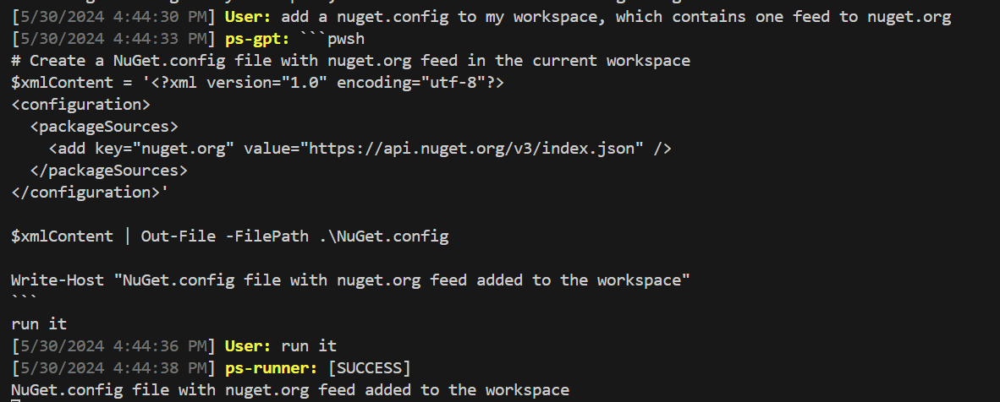

# The [ChatRoom](https://github.com/LittleLittleCloud/Agent-ChatRoom) for powershell agents

This repo contains the quick-start configuration for powershell agents.

## Quick Start

1. Clone this repo and navigate to the root directory of the repo.

2. Run the following command to restore dotnet tools

```bash
dotnet tool restore
```

3. Run the following command to start the chatroom

```bash
dotnet chatroom -c client.json
```

4. Replace the `openai-api-key` in both [client.json](client.json) and [server.json](powershell.json) with your own OpenAI API key.

5. Start chatting with powershell agents in the `General` channel!

```bash
dotnet chatroom -c client.json
```

